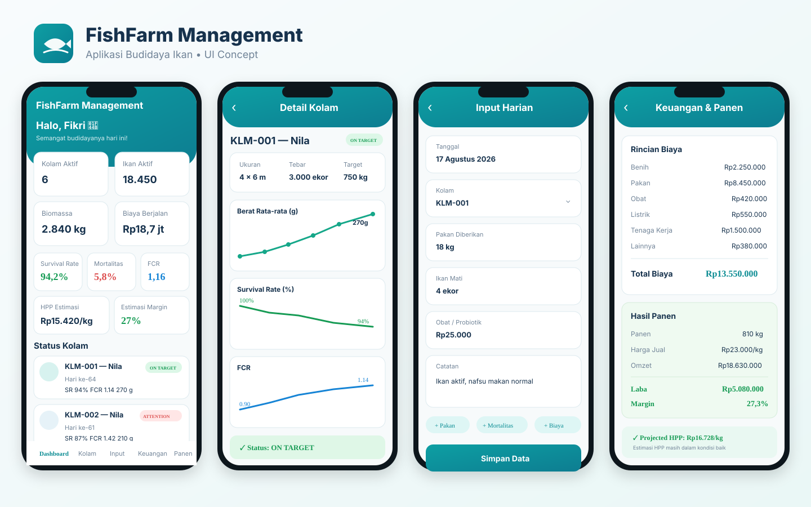

# FishFarm Management

Mobile-first aquaculture farm management system for recording pond operations, biological performance, production cost, harvest outcomes, and actionable farm decisions.

## Vision

Turn daily fish-farming records into a simple operating system for farmers: **record → measure → detect → decide → improve**.

The first version is intentionally not AI-first. Core calculations and alerts are deterministic and explainable. AI can be added later after enough real farm-cycle data exists.

## UI Concept

The mockup above is the initial visual direction for Dashboard, Pond Detail, Daily Input, and Finance & Harvest. See [`docs/UI_REFERENCE.md`](docs/UI_REFERENCE.md) for screen behavior and implementation guidance.

## V0.1 Scope

The product foundation is documented before implementation:

- Product Requirements Document (PRD)
- System architecture
- Domain and data model
- KPI/formula model
- Rules-based Decision Engine
- UI reference
- MVP roadmap

## MVP Modules

1. Dashboard
2. Pond Management
3. Production Cycles
4. Daily Input
5. Sampling & Growth
6. Expenses & Costing
7. Harvest & Sales
8. Alerts / Decision Engine

## Core KPIs

- Survival Rate (SR)
- Mortality Rate
- Average Body Weight (ABW)
- Estimated Population
- Estimated Biomass
- Feed Conversion Ratio (FCR)
- Feed Cost
- Total Production Cost
- Estimated / Actual HPP per kg
- Break-even Selling Price
- Revenue
- Net Profit
- Margin
- Cycle Duration
- Harvest Projection

## Product Principles

- Mobile-first and fast to input in the field
- One source of truth: application database, not spreadsheets
- Every important KPI must be traceable to raw records
- Operational, biological, and financial data are connected by production cycle
- Alerts must explain why they fired
- Historical cycles must remain immutable enough for comparison and audit
- Start simple; add sensors, AI, and automation only when useful data exists

## Documentation

- [`docs/PRD.md`](docs/PRD.md)
- [`docs/ARCHITECTURE.md`](docs/ARCHITECTURE.md)
- [`docs/DOMAIN_MODEL.md`](docs/DOMAIN_MODEL.md)
- [`docs/KPI_MODEL.md`](docs/KPI_MODEL.md)
- [`docs/DECISION_ENGINE.md`](docs/DECISION_ENGINE.md)
- [`docs/UI_REFERENCE.md`](docs/UI_REFERENCE.md)
- [`docs/ROADMAP.md`](docs/ROADMAP.md)

## Initial Technical Direction

Recommended baseline:

- **Frontend:** Next.js + TypeScript, responsive PWA
- **Backend:** Next.js API / service layer initially; separable later
- **Database:** PostgreSQL
- **ORM:** Prisma or Drizzle
- **Authentication:** email/password or managed auth provider
- **Charts:** lightweight web chart library
- **Deployment:** managed web hosting + managed PostgreSQL
- **Notifications later:** Telegram / WhatsApp / push notification adapters

The architecture is designed as a **modular monolith first**, not microservices. This keeps development, deployment, and debugging simple while preserving clear domain boundaries.

## Status

**Phase:** Product & Architecture Foundation  
**Version:** 0.1  
**Implementation:** not started
