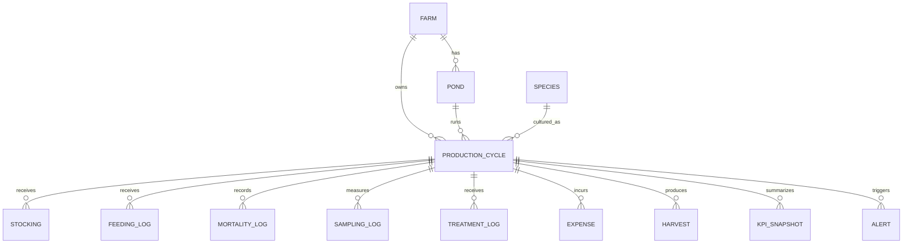

# Domain & Data Model — FishFarm Management

Version: 0.1

## 1. Modeling Principle

The primary unit of analysis is the **Production Cycle**.

A pond is a physical asset. A production cycle is a biological and financial operating period inside that pond. All feeding, mortality, sampling, expenses, and harvest records should be attributable to a cycle whenever possible.

```text
Farm
  |
  +-- Pond
       |
       +-- ProductionCycle
             |
             +-- Stocking
             +-- FeedingLog
             +-- MortalityLog
             +-- SamplingLog
             +-- TreatmentLog
             +-- Expense
             +-- Harvest
             +-- KPISnapshot
             +-- Alert
```

## 2. Core Entities

## Farm

Represents the farm/business scope.

Suggested fields:
- `id` UUID
- `name`
- `owner_user_id`
- `location_text` optional
- `timezone` default `Asia/Jakarta`
- `currency` default `IDR`
- `created_at`
- `updated_at`

## Pond

Represents one physical pond/tank/unit.

Suggested fields:
- `id` UUID
- `farm_id` FK
- `code` unique within farm, e.g. `KLM-001`
- `name`
- `pond_type`
- `length_m` optional
- `width_m` optional
- `depth_m` optional
- `volume_m3` optional
- `status`: `ACTIVE | INACTIVE | MAINTENANCE`
- `notes` optional
- `created_at`
- `updated_at`

Constraint:
- one pond may have many historical cycles
- only one `ACTIVE` cycle per pond in MVP

## Species

Reference/master data.

Suggested fields:
- `id`
- `common_name` e.g. `Nila`
- `scientific_name` optional
- `default_unit`
- `active`

MVP may seed species rather than expose a full species admin module.

## ProductionCycle

Central aggregate for one farming cycle.

Suggested fields:
- `id` UUID
- `farm_id` FK
- `pond_id` FK
- `species_id` FK
- `cycle_code`, e.g. `KLM-001-2026-01`
- `status`: `PLANNED | ACTIVE | HARVESTING | COMPLETED | CANCELLED`
- `stocking_date`
- `target_harvest_date` optional
- `completed_at` optional
- `initial_stock_qty`
- `initial_avg_weight_g` optional
- `initial_biomass_kg` derived or snapshot
- `target_sr_pct` optional
- `target_fcr` optional
- `target_harvest_weight_kg` optional
- `target_hpp_per_kg` optional
- `target_selling_price_per_kg` optional
- `notes` optional
- `created_at`
- `updated_at`

## Stocking

Stores stocking event details separately from cycle configuration when more traceability is needed.

Suggested fields:
- `id`
- `cycle_id`
- `event_date`
- `quantity`
- `avg_weight_g` optional
- `seed_cost_per_unit` optional
- `total_seed_cost`
- `supplier` optional
- `notes` optional

For MVP one initial stocking event is sufficient, but the model should not prevent later restocking events.

## FeedingLog

One feed event.

Suggested fields:
- `id`
- `cycle_id`
- `event_at`
- `feed_type_id` optional
- `quantity_kg`
- `unit_cost_per_kg` optional
- `total_cost` optional/derived
- `notes` optional
- `created_by`
- `created_at`

Do not store cumulative feed here. Cumulative values are derived.

## FeedType

Optional master data, useful once inventory/cost tracking expands.

Fields:
- `id`
- `farm_id`
- `name`
- `brand` optional
- `protein_pct` optional
- `default_unit_cost` optional
- `active`

## MortalityLog

One mortality observation/event.

Suggested fields:
- `id`
- `cycle_id`
- `event_at`
- `quantity`
- `suspected_cause` optional
- `notes` optional
- `created_by`
- `created_at`

Do not store mortality percentage as raw data.

## SamplingLog

One biological sampling event.

Suggested fields:
- `id`
- `cycle_id`
- `sampled_at`
- `sample_count`
- `total_sample_weight_kg` optional
- `average_weight_g` optional
- `average_length_cm` optional
- `observed_population` optional
- `notes` optional
- `created_by`
- `created_at`

Rule:
- at least one of `total_sample_weight_kg` or `average_weight_g` must be provided
- if both are provided, server validates reasonable consistency

## TreatmentLog

Operational health/treatment event.

Suggested fields:
- `id`
- `cycle_id`
- `event_at`
- `treatment_type`
- `product_name` optional
- `quantity` optional
- `unit` optional
- `cost` optional
- `reason` optional
- `notes` optional

## Expense

Financial transaction attributable to farming operations.

Suggested fields:
- `id`
- `farm_id`
- `cycle_id` optional for shared farm cost
- `pond_id` optional
- `expense_date`
- `category`
- `description`
- `amount`
- `allocation_type`: `DIRECT | SHARED`
- `notes` optional
- `created_at`

MVP direct categories:
- `SEED`
- `FEED`
- `MEDICINE`
- `PROBIOTIC`
- `ELECTRICITY`
- `WATER`
- `LABOR`
- `MAINTENANCE`
- `TRANSPORT`
- `OTHER`

Important implementation decision:
Feed and seed costs must not be double-counted if a feeding/stocking log already creates corresponding expenses. Use one canonical approach in implementation:

**Recommended:** operational events optionally create linked financial transactions via `source_type/source_id`.

## Harvest

Represents partial or final harvest.

Suggested fields:
- `id`
- `cycle_id`
- `harvested_at`
- `harvest_type`: `PARTIAL | FINAL`
- `fish_count` optional
- `weight_kg`
- `selling_price_per_kg`
- `revenue` derived/snapshotted
- `buyer_name` optional
- `harvest_cost` optional
- `notes` optional
- `created_at`

A cycle may have multiple partial harvests and one final closing event.

## KPISnapshot

Optional optimization/audit table. Raw data remains authoritative.

Suggested fields:
- `id`
- `cycle_id`
- `snapshot_at`
- `estimated_population`
- `survival_rate_pct`
- `mortality_rate_pct`
- `avg_weight_g`
- `estimated_biomass_kg`
- `cumulative_feed_kg`
- `fcr`
- `total_cost`
- `estimated_hpp_per_kg`
- `projected_revenue` optional
- `projected_margin_pct` optional
- `calculation_version`

## Alert

Output of Decision Engine.

Suggested fields:
- `id`
- `cycle_id`
- `rule_code`
- `severity`: `INFO | WARNING | ACTION_REQUIRED`
- `status`: `OPEN | ACKNOWLEDGED | RESOLVED`
- `title`
- `message`
- `metric_name` optional
- `metric_value` optional
- `threshold_value` optional
- `recommended_action` optional
- `triggered_at`
- `resolved_at` optional
- `rule_version`

## User / Membership

MVP can support one owner, but schema should not block future roles.

Suggested fields:
- `User`
- `FarmMembership`

Roles later:
- `OWNER`
- `MANAGER`
- `OPERATOR`
- `VIEWER`

## 3. Relationship Model



## 4. Source-of-Truth Rules

### Population
Initial stock quantity minus recorded mortalities minus known harvested fish count when population count is available.

Because harvest fish count may be unknown, population estimates must be labeled **estimated** when exact subtraction is impossible.

### Biomass
Latest reliable ABW × estimated live population.

Harvested biomass is kept separately from standing biomass.

### Feed
Sum of feeding logs by cycle.

### Cost
Sum of canonical financial transactions allocated to cycle.

### Revenue
Sum of `harvest.weight_kg × harvest.selling_price_per_kg` adjusted only by explicit sales corrections.

## 5. Precision Recommendations

- money: fixed decimal / numeric, never binary floating point
- kilograms: decimal with sufficient precision
- percentages: calculate at runtime, store snapshot only when needed
- timestamps: store UTC, display in farm timezone
- dates like stocking/harvest day: domain date when time-of-day is not meaningful

## 6. Audit Requirements

Raw operational/financial records should keep:
- created timestamp
- updated timestamp
- author where available

For completed cycles:
- prevent accidental destructive edits
- significant corrections should be auditable
- final KPI summary should record formula/calculation version

## 7. Future Model Extensions

Not required in MVP:
- water quality readings (`pH`, `DO`, temperature, ammonia)
- feed inventory lots
- supplier purchase orders
- disease events
- medication protocols
- photos
- sensor devices
- farm shared-cost allocation rules
- sale invoice/payment status
- multi-site organization model
