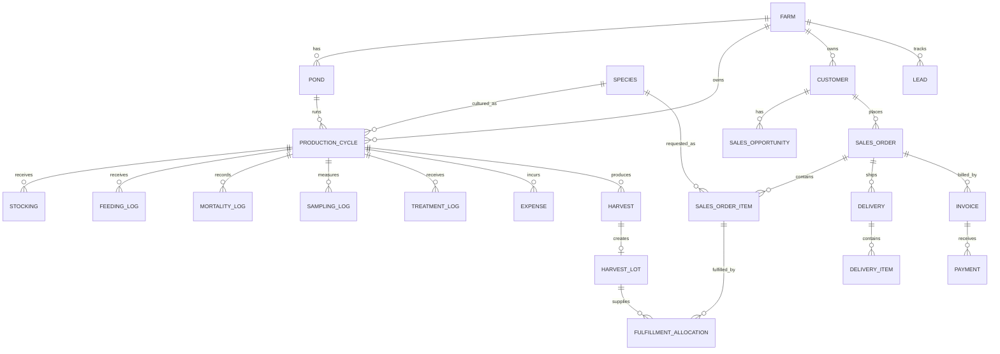

# Domain & Data Model — FishFarm Management

Version: 0.8

## 1. Domain Principle

FishFarm Management now has two primary business domains inside one modular monolith:

1. **Aquaculture Production**
2. **Sales CRM**

They share a farm/business context but have different responsibilities and source-of-truth rules.

Production remains centered on **ProductionCycle**. Sales CRM remains centered on **Customer demand and commercial transactions**.

The domains connect only through harvested inventory fulfillment.

```text
PRODUCTION                                  SALES CRM

Farm                                        Farm
  ↓                                           ↓
Pond                                        Lead
  ↓                                           ↓
ProductionCycle                             Customer
  ↓                                           ↓
Stocking / Feed / Sampling                  Opportunity
  ↓                                           ↓
Harvest                                     SalesOrder
  ↓                                           ↓
HarvestLot        ← FulfillmentAllocation → SalesOrderItem
                                               ↓
                                            Delivery
                                               ↓
                                            Invoice
                                               ↓
                                            Payment
```

## 2. Production Aggregate

A pond is a physical asset. A production cycle is the biological and financial operating period inside a pond.

```text
Farm
  └── Pond
       └── ProductionCycle
            ├── Stocking
            ├── FeedingLog
            ├── MortalityLog
            ├── SamplingLog
            ├── TreatmentLog
            ├── Expense
            ├── Harvest
            ├── KpiSnapshot
            └── Alert
```

Production rules from earlier versions remain valid:

- raw events are authoritative,
- cumulative feed is derived,
- mortality percentages are derived,
- biomass is calculated from population + ABW,
- FCR uses biomass gain,
- Expense is the canonical production-cost ledger,
- partial harvest must not be interpreted as mortality,
- completed-cycle values must distinguish actual final from estimates.

## 3. Production Entities

### Farm

Business scope shared by both production and commercial data.

Core fields:
- `id`
- `name`
- `location_text`
- `timezone`
- `currency`

### Pond

Physical pond/tank/unit.

A pond can have many historical production cycles, but only one `ACTIVE` or `HARVESTING` cycle in the MVP.

### Species

Master species data shared by production and Sales CRM product-interest/order lines.

Using Species in CRM does **not** create a dependency on a specific pond/cycle.

### ProductionCycle

Central production aggregate.

Owns biological targets, production lifecycle, and all cycle raw records.

### Stocking

Raw fish-stocking event.

### FeedingLog

Raw feed event. Cumulative feed is derived.

### MortalityLog

Raw mortality observation.

### SamplingLog

Biological sample used for ABW, growth, population context, biomass, and FCR.

### TreatmentLog

Treatment/probiotic/health operation record.

### Expense

Canonical production-cost ledger.

Operational records may create one linked Expense using `source_type/source_id` to prevent double counting.

### Harvest

Production fact representing partial/final harvest.

A Harvest is **not a SalesOrder**.

V0.8 retains legacy commercial snapshot fields on Harvest for compatibility:
- `selling_price_per_kg`
- `revenue_amount`
- `buyer_name`

These will be reviewed after runtime validation and migration planning.

### KpiSnapshot

Optional calculated cache/audit snapshot. Raw records remain authoritative.

### Alert

Decision Engine output with `OPEN / ACKNOWLEDGED / RESOLVED` lifecycle.

## 4. Sales CRM Aggregate

Sales CRM handles relationships, demand, commercial commitments, fulfillment, billing, and collection.

```text
Lead
  ↓
Customer
  ↓
SalesOpportunity
  ↓
SalesOrder
  └── SalesOrderItem
         ↓
FulfillmentAllocation
         ↑
HarvestLot

SalesOrder
  ├── Delivery
  └── Invoice
       └── Payment
```

The important boundary rule is:

> Lead, Customer, Opportunity, and SalesOrder do not point directly to Pond or ProductionCycle.

## 5. Customer

Represents a known buyer/account.

Customer types:
- `RESTAURANT`
- `WHOLESALER`
- `RETAILER`
- `MARKET`
- `HOTEL`
- `CATERING`
- `INDIVIDUAL`
- `OTHER`

Typical fields:
- name
- contact person
- phone
- WhatsApp
- email
- address
- active status
- notes

Customer can have many opportunities, interactions, and sales orders.

## 6. Lead

Represents potential demand before a committed transaction exists.

Lifecycle:

```text
NEW → CONTACTED → QUALIFIED → CONVERTED
                         ↘ LOST
```

A Lead can optionally reference `Species` as product interest, but never a production cycle.

Fields include:
- title
- source
- contact details
- expected demand kg
- expected price/kg
- next follow-up
- notes

## 7. SalesOpportunity

Qualified commercial opportunity associated with a Customer.

Can store:
- expected quantity kg
- expected selling price/kg
- expected close date
- species interest
- status `OPEN | WON | LOST`

Pipeline value is derived from quantity × expected price when both exist.

## 8. CustomerInteraction

Commercial activity history.

Types:
- `WHATSAPP`
- `CALL`
- `MEETING`
- `EMAIL`
- `NOTE`

At least one CRM target must exist:
- customer,
- lead,
- opportunity.

It can also store `next_follow_up_at`.

## 9. SalesOrder

Represents a customer commitment.

Lifecycle:

```text
DRAFT
  ↓
CONFIRMED
  ↓
PARTIALLY_FULFILLED
  ↓
FULFILLED

or CANCELLED
```

SalesOrder can exist before harvested inventory exists.

It references Customer and optionally Opportunity, but not Pond/ProductionCycle.

## 10. SalesOrderItem

Commercial product line.

Current V0.8 fields:
- species
- description
- quantity kg
- unit price/kg

Order value is derived from line quantity × unit price.

## 11. HarvestLot

Sellable harvested-inventory lot created from one Harvest.

```text
HarvestLot → Harvest → ProductionCycle → Pond
```

That path preserves source traceability without forcing SalesOrder to depend on production internals.

Important fields:
- `harvest_id` unique
- `farm_id`
- `species_id`
- `lot_code`
- `quantity_kg`
- optional quality grade

Each newly recorded Harvest creates a HarvestLot in the same transaction.

## 12. FulfillmentAllocation

Explicit integration bridge:

```text
SalesOrderItem ← FulfillmentAllocation → HarvestLot
```

Allocation statuses:
- `RESERVED`
- `FULFILLED`
- `CANCELLED`

Application-service validation checks:
- same farm,
- same species,
- allocation does not exceed remaining order quantity,
- allocation does not exceed available HarvestLot quantity.

Available harvested stock is derived:

```text
HarvestLot quantity - active allocation quantity
```

## 13. Delivery

Physical delivery/hand-over record linked to SalesOrder.

Delivery items reference SalesOrderItem quantities.

Lifecycle:
- `PLANNED`
- `DISPATCHED`
- `DELIVERED`
- `CANCELLED`

## 14. Invoice

Billing snapshot linked to SalesOrder.

Stored totals intentionally preserve historical billing even if an order is corrected later through an explicit flow.

Lifecycle:
- `DRAFT`
- `ISSUED`
- `PARTIALLY_PAID`
- `PAID`
- `VOID`

## 15. Payment

Cash receipt against an Invoice.

Multiple Payment records support:
- DP,
- partial payment,
- final settlement.

Methods:
- cash
- transfer
- QRIS
- other

Outstanding receivable is derived:

```text
invoice total - sum(payment amount)
```

## 16. Relationship Model



## 17. Source-of-Truth Rules

### Production
- population: stocking/mortality/known harvest counts
- biomass: latest reliable ABW × current population context
- feed: FeedingLog
- production cost: Expense
- production KPI: raw production records

### Commercial
- prospect pipeline: Lead / SalesOpportunity
- customer commitment: SalesOrderItem
- harvested inventory: HarvestLot
- physical stock commitment: FulfillmentAllocation
- billing: Invoice
- cash receipt: Payment

### Critical Boundary

Sales CRM cannot silently redefine:
- SR,
- FCR,
- biomass,
- production cost,
- cycle biological state.

Production cannot infer a commercial order merely because a Harvest has a legacy buyer-name snapshot.

## 18. Audit & Precision

- IDs: UUID
- money: PostgreSQL numeric/decimal
- kg: fixed decimal
- timestamps: timestamptz
- business dates: date when time-of-day is irrelevant

Historical production and commercial transactions should not be destructively rewritten without an explicit correction strategy.

## 19. Next Model Extensions

After runtime validation and real usage:
- configurable CRM lead sources
- quotation
- multiple product grades/sizes
- returns/claims
- delivery proof
- customer price history
- customer profitability
- supplier/feed inventory domain
- water quality and sensor data
- organization/multi-farm model
